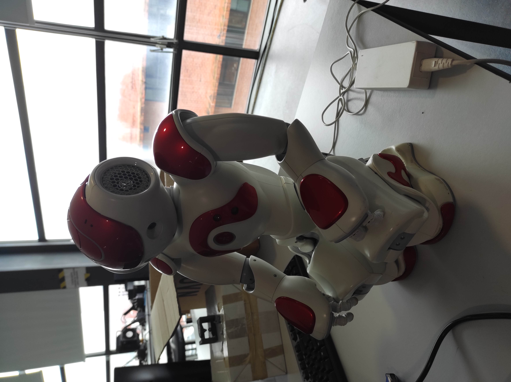

# Blog com os registos do progresso

## 11 de outubro de 2024

Fui ao laboratório para começar o processo de conhecer o robô.
Coloquei a carregar, e apresentou a luz verde, o que indicaria que ou estava ou carregado ou não ligado corretamente.
No luz passava a vermelho quando tentava ligar o robô, o que indica que estava a carregar.
Fiquei sem saber se ele carrega sem estar ligado, ou o motivo pelo qual mostra uma cor errada. Testarei o carregamento na próxima vez.
Ligar o robô na posição default, aquela que ele assume quando se desliga, de joelhos, fazia com que quando o robô iniciava dissesse algo do tipo "Some of my motors are hot", e antes de completar a frase desligava-se sozinho. 
Ligar o robô de pé resolveu este problema, e ele mantinha a postura.
Tentei mandar um programa para o robô mas não funcionou, testarei novamente na próxima vez. 
Configurar o robô não foi possível também, pelo que assumo que ele já está configurado do antigo utilizador.
No fim arrumei o robô e vim embora.

## 16 de outubro de 2024

Vim ao laboratório novamente para tentar colocar o robô a funcionar a primeira vez e correr um programa.
Quando cheguei de manhã o robô queixava-se do braço esquerdo e da perna esquerda.
O robô não mexe o braço esquerdo, ou mexe muito pouco. 
Com o robô desligado verifiquei e o braço está de facto perro, a perna está ok.
Nas tentativas seguintes queixou-se somente do braço, até que se deixou se queixar, diz só algo parecido com "Ahhhhh" ao ligar-se.
Tentei mandar falar, mas creio que é preciso ter um programa instalado que eu não consigo verificar que está, ou instalar eu mesmo.
Mudei então para o tentar fazer sentar e levantar-se.
Quando se senta, chega a um ponto em que só se desliga, suponho que deve haver algum bug no robô quando as juntas das pernas têem um certo valor.
Depois tentei fazer com que ele andasse.

